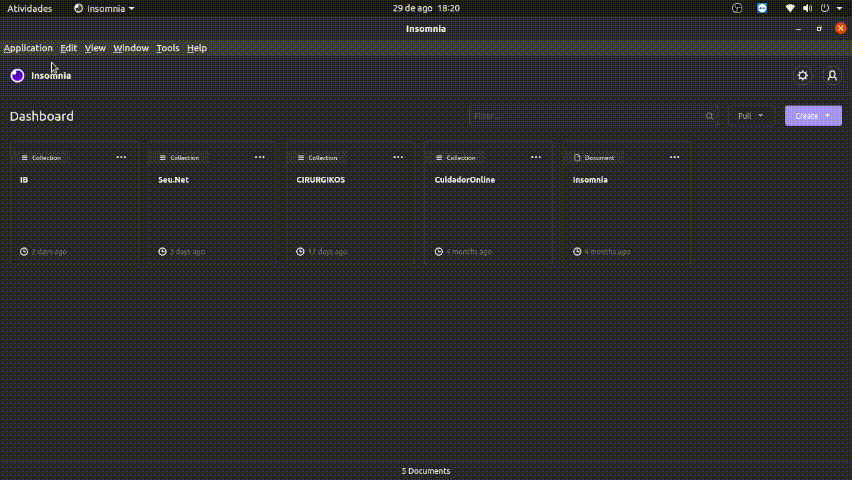
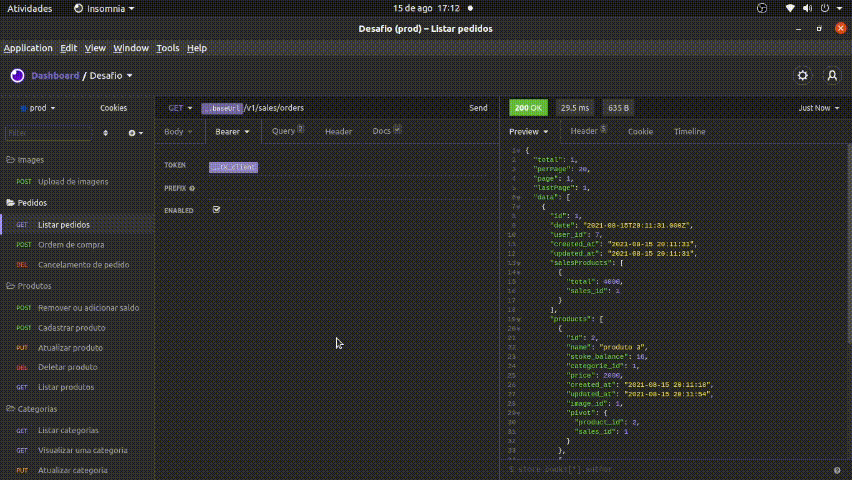

<p align="center">
  <a href="http://nestjs.com/" target="blank"></a>
</p>
 
  <p align="center">Projeto de estudos gerado a partir dos vídeos do <a href="https://youtube.com/angelogluz" target="blank">Canal do Youtube</a>.</p>
    <p align="center">
<a href="https://github.com/angelogluz/nest-angelo-youtube/stargazers"></a>

  <a href="https://github.com/angelogluz/nest-angelo-youtube/commits/master">
    
  </a>
    <a href="https://github.com/angelogluz/nest-angelo-youtube/issues">
    
  </a>
    <a href="https://github.com/angelogluz/nest-angelo-youtube/pulls">
    
  </a>
    <a href="https://github.com/angelogluz/Youtube-codes/blob/master/LICENSE">
    
  </a>
</p>


## 🔐 Pré requisitos

<a href="https://www.docker.com/">Docker</a> &nbsp;
  
<a href="https://docs.docker.com/compose/install/">Docker-compose</a> &nbsp;


## Para que o Typescript funcione no Host apropriadamente instale as dependências

```bash
$ npm install
```

## Executando a aplicação

```bash
# development
$ docker-compose up
```

## Docs

Importe o arquivo para o insomnia:




Alterar nível de acesso:


